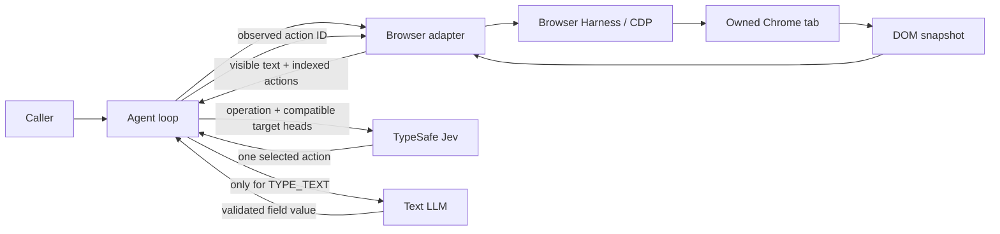
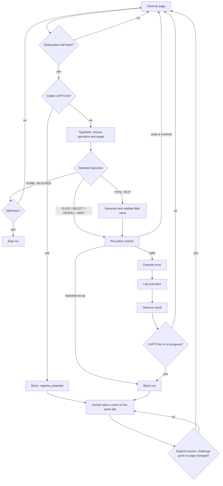

# Jev Ultrafast: architecture

Jev Ultrafast takes a natural-language goal, observes the current browser page, chooses **one supported action**, executes it, and observes again. It is a small browser executor, not a general planner: it has no site-specific scripts, persistent task queue, or payment workflow. This document describes the **current implementation** in this repository.

## System at a glance



| Layer | Responsibility | Source |
| --- | --- | --- |
| Caller | Supplies the starting URL and one goal; consumes run state and supplies any user interface. | [`jev_ultrafast/agent.py`](jev_ultrafast/agent.py) |
| Agent | Coordinates observe → decide → act, tracks action history, enforces budgets, and stops on completion or a block. | [`jev_ultrafast/agent.py`](jev_ultrafast/agent.py) |
| Observation | Reads visible page text, controls, values, and CAPTCHA signals in one browser-side evaluation. | [`jev_ultrafast/snapshot.js`](jev_ultrafast/snapshot.js) |
| Decision | Offers only operations and targets observed on the current page. Validates the selected TypeSafe answer. | [`jev_ultrafast/model.py`](jev_ultrafast/model.py), [`jev_ultrafast/questions.py`](jev_ultrafast/questions.py) |
| Loop guard | Compares completed actions with stable visible-page states and stops repeated no-ops or short cycles. | [`jev_ultrafast/loop_guard.py`](jev_ultrafast/loop_guard.py) |
| Text helper | Generates a value for a selected editable field; has no browser control. | [`jev_ultrafast/model.py`](jev_ultrafast/model.py) |
| Execution | Uses Browser Harness and Chrome DevTools Protocol (CDP) to check freshness, resolve the observed node, and send browser input. | [`jev_ultrafast/browser.py`](jev_ultrafast/browser.py) |

### Architectural rules

- The goal remains the same throughout the run. There is no prewritten sequence of website actions or field values.
- Jev chooses an **operation and compatible target in one request**. Only the target head for the chosen operation can be executed.
- The model selects from code-created action IDs. It cannot supply selectors, coordinates, JavaScript, or shell commands.
- The text helper runs only after `TYPE_TEXT` is selected. Its output is data for one field, never an instruction to the browser.
- A model's `DONE` choice ends the loop, but does **not** independently prove the user's goal was met. Callers must verify important outcomes against the resulting page or another source.

## One decision cycle



| Stage | What happens | Important boundary |
| --- | --- | --- |
| Observe | A browser-side snapshot returns URL, title, visible text, indexed actions, element state, freshness data, and any recognized CAPTCHA. | The normal agent loop uses structured DOM data; screenshots are optional and are **not** sent to Jev. |
| Decide | TypeSafe receives the goal, current page, indexed elements, and up to 10 recent actions. It answers an operation question and operation-specific target questions in one call. | The selected operation and its selected target are validated against the offered choices and probability distributions. |
| Generate text | For `TYPE_TEXT`, an OpenAI-compatible text model sees the goal, chosen field, a bounded page excerpt, and up to six recent actions. | It must return `{"text":"..."}` with one nonblank string of at most 2,000 characters. Missing or invalid text means nothing is typed. |
| Execute | The browser checks current page/target state, then clicks, replaces field text, selects a native option, scrolls, or waits. | The decision is consumed before mutation; browser mutations are not automatically retried. |
| Record and repeat | The executed action is logged **before** the next observation. The next snapshot determines whether the page changed and what to do next. | A failed post-action observation cannot erase the fact that input may already have occurred. |
| Human handoff | A blocked run exposes its existing tab for live screenshots and bounded human pointer/keyboard input. A read-only check reports when the page changed and no challenge is visible. On explicit resume, the same tab is re-observed before another model call. | A visible challenge or unchanged page keeps the run blocked; the agent never acts while human control is active. The task app can use this handoff even with headless Chrome. |

If the page goes stale after text generation, the generated value can be reused only when the **entire** text-helper input remains identical. A successful mutation clears that cached value.

## Observation and action contract

The snapshot uses common HTML and ARIA roles to collect on-screen controls, their accessible-like names, current values or checked state, visible page text, and available native `<select>` options. A node keeps a code-owned identity while it remains connected; a replacement node receives a new identity. The model sees a numbered element table, while the executor retains the corresponding live node references. These identities are not CDP backend node IDs.

| Observation field | Purpose |
| --- | --- |
| `url`, `title`, `text` | Current page context. Visible text is capped at 6,000 characters. |
| `actions` | Up to 250 observed element actions, plus available scroll and wait controls. Each action has a code-owned ID. |
| `page_key`, `guards`, `marker` | Check that the document, form values, selected target, nearby context, or full semantic page state have not changed unexpectedly. |
| `captcha` | A recognized visible widget or challenge page; causes an immediate block. |
| `fingerprint` | Hash used for decision/result comparison and the predict → act handoff. |
| `screenshot` | Optional JPEG for inspection or recording. Absent from the default library loop and not part of the model request. |

| Offered operation | What the executor can do | Source of target/value |
| --- | --- | --- |
| `CLICK` | Click an observed, currently usable element. | Observed node ID; geometry is read again immediately before input, and the pointer aims inside the element rather than at its exact centre. |
| `TYPE_TEXT` | Click an editable field, select its existing contents, insert generated text. | Observed field ID plus separately validated text-helper output. |
| `SELECT` | Choose an observed enabled option in a native dropdown. | Observed node and option value; the code dispatches input/change events. |
| `SCROLL_UP`, `SCROLL_DOWN` | Scroll the main page by a fixed amount when offered. | Snapshot-created controls. |
| `WAIT` | Pause briefly for a page update. | Snapshot-created control; not a substitute for a missing action. |
| `DONE`, `BLOCKED` | End the run. | TypeSafe decision, subject to a final freshness check. |

The snapshot excludes password and file inputs, hidden inputs, disabled controls, and offscreen text from normal action choices. It does not implement the full browser accessibility-name algorithm. The first 250 element actions are retained; `omitted_actions` reports any excess.

## Browser runtime and safety checks

The browser adapter asks Browser Harness to provide a CDP connection, creates an owned Chrome tab, and navigates to the starting URL. It reads one snapshot per observation and keeps the same CDP session for the run. The owned tab shares the existing Chrome profile. Background focus emulation keeps menus and animation frames rendering without activating the user's visible tab.

| Situation | Current behavior |
| --- | --- |
| Page changed before a decision | Re-observe, then choose from the new page. |
| Page changed after a decision | Reject the stale action and re-observe. Click/select use a target-and-context guard; text, scroll, wait, and completion use the full semantic marker. |
| Target removed, disabled, hidden, read-only, or covered | Reject before browser input. The executor rechecks the current geometry and hit-tests click targets. |
| Navigation interrupts a post-action read | Preserve the logged execution, then inspect the resulting page. Do not replay the mutation. |
| Native select evaluation is interrupted | Stop for inspection because the change event may already have fired. |
| CAPTCHA detected | Set `status=blocked` and `block_reason.code=captcha_detected`; do not attempt to solve it. |
| An action returns to the same visible page | Exclude transient DOM node IDs from the progress fingerprint. Re-observe after one second before counting a no-op. After two identical no-ops, warn the model; if it chooses the same action again, block before browser input. |
| Repeated waiting or short navigation cycle | Block before a fifth unchanged `WAIT`, after five consecutive no-op actions, or after three complete repeats of a two- or three-step action/page cycle. Meaningful page changes permit repeated actions. |
| Run budget reached | Limit a run to 60 browser actions and 120 TypeSafe decision calls. The action limit blocks; the decision-call limit raises an error before another model call. |

CAPTCHA detection is deliberately bounded. It recognizes visible reCAPTCHA, hCaptcha, Turnstile, Arkose, GeeTest, and Friendly Captcha widgets through known frames or containers, a Cloudflare challenge page, and visible human-verification challenge overlays. It also treats a visibly titled CAPTCHA/“verify you are human” frame as an unknown provider. Loading a CAPTCHA script alone does not stop the run. Other challenge designs may be missed, so this is a guard rather than comprehensive anti-bot detection.

The browser leaves at least one second between completed actions and checks page freshness again after that pause. An explicit `WAIT` lasts one second. For editable comboboxes, the first observation after typing waits briefly for visible options (up to 200 ms); other interactions get at most two animation frames or 50 ms. If that first observation still matches the previous page, the agent waits one second and reads again before making another model call. These bounded pauses help avoid rapid repeated input but cannot guarantee that a network request has completed or prevent an anti-bot challenge.

Loop detection draws on [Browser Use's action/page fingerprint and model-nudge design](https://github.com/browser-use/browser-use/blob/main/browser_use/agent/views.py) and [OpenHands' repeated action–observation checks](https://github.com/OpenHands/software-agent-sdk/blob/main/openhands-sdk/openhands/sdk/conversation/stuck_detector.py). Jev uses a hard stop only for recent, consecutive patterns because its low-cost classifier ignored the maintenance-page warning in the observed DEWA run. It records only actions actually dispatched to the browser, not merely proposed choices. These checks can still mistake a deliberately repeated workflow for a loop; after human intervention, the detector starts a fresh segment while preserving the action history.

## State, integrations, and deployment shape

| Agent status | Meaning |
| --- | --- |
| `ready` | A page has been observed and the next decision can be requested. |
| `predicted` | A TypeSafe decision exists for the current page fingerprint, awaiting execution. |
| `paused` | A pause was requested. No model call is made and no page input is dispatched. `continue` clears it, and the next decision observes the page again rather than reusing the dropped one. |
| `done` | TypeSafe selected `DONE` on a fresh page; external outcome verification is still needed. |
| `blocked` | TypeSafe selected `BLOCKED`, a CAPTCHA was detected, no progress was observed, or the action budget was reached. `block_reason` identifies CAPTCHA and no-progress stops. Within the action budget, a human can change the page and explicitly resume. |

| Concern | Current design |
| --- | --- |
| Run state | In-memory goal, page, pending decision, action history, model calls, elapsed time, human-control flag, and status. A new `Agent` starts a new run; handoff resume works only while the process and tab survive. |
| Credentials | `TYPESAFE_API_KEY` and `TEXT_MODEL_API_KEY` are read from the environment. Scripts running outside the package may load `.env` from the working directory when present. Keys are not sent to the browser page. |
| Model APIs | TypeSafe's `systemone` endpoint handles the operation/target choices. A configurable OpenAI-compatible chat-completions endpoint handles field text. Provider connection/rate-limit errors may retry, but browser mutations do not. |
| Observability | The returned state includes decisions, probabilities, model usage/latency, text calls, executed actions, and page-change flags. Optional recording writes frames under the chosen local directory. |
| Dependency footprint | Python 3.12+, Browser Harness/CDP, `httpx`, TypeSafe API, a text-model API, and a Chrome browser. No database or distributed worker is part of this package. |

## Known limits and extension points

| Area | Current limit | Where an extension would fit |
| --- | --- | --- |
| Page coverage | Common top-document HTML/ARIA controls only. Shadow DOM, cross-origin frames, canvas, uploads, pop-up tabs, nested scrolling, and complex keyboard widgets can block progress. | Extend snapshot collection and matching execution methods together. |
| CAPTCHA | Visible-provider heuristic, with a stop and explicit human handoff. It does not classify every possible challenge or solve one. | Expand detection signals and handoff UX without turning the challenge into an agent action target. |
| Task completion | `DONE` is a model choice based on visible state. | Add task-specific, independent verification in the caller, as the examples do. |
| Long-running work | No persistence, scheduling, or recovery after process restart. | Wrap `Agent` in a durable task system rather than holding a run inside one process. |
| Sensitive workflows | No approval gates, payment safeguards, or credential vault. | Add these at a higher application layer before using browser actions for consequential tasks. |

## Validation

Offline tests exercise choice validation, observed targets, stale-page behavior, browser guards, text-helper handling, and agent loop behavior. The repository's local checks are:

```bash
uv run ruff check .
uv run pytest
node --check jev_ultrafast/snapshot.js
uv build
```

Live examples require model credentials and may incur API charges. Their final outcome checks are separate from the agent's `DONE` decision.
